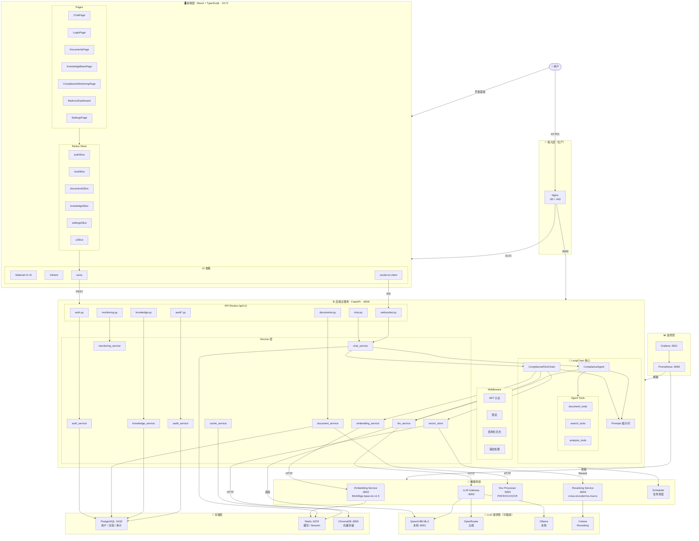
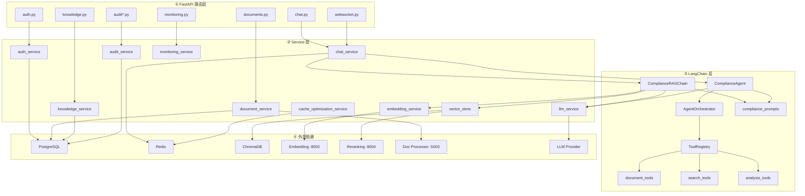
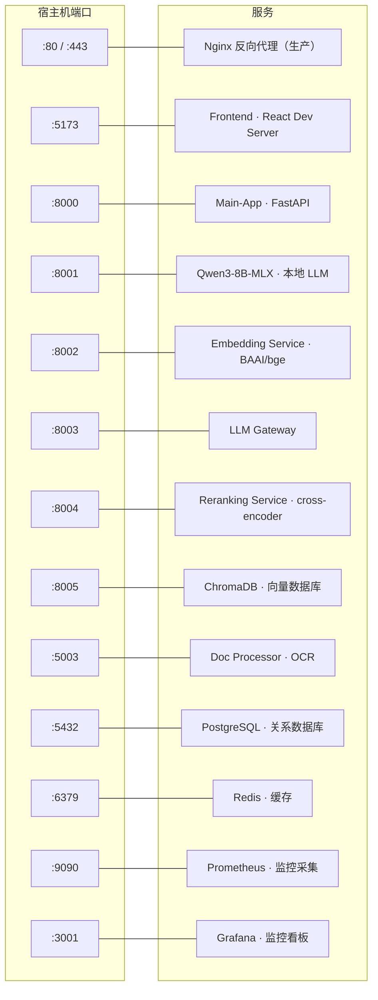

# 项目依赖关系图 · Drass 合规助手平台

---

## 1. 完整系统架构依赖图

```mermaid
graph TB
    %% 用户入口
    User(["👤 用户"])

    %% 接入层
    subgraph GATEWAY["🔀 接入层（生产）"]
        Nginx["Nginx\n:80 / :443"]
    end

    %% 前端
    subgraph FRONTEND["🖥️ 前端层 · React + TypeScript · :5173"]
        subgraph PAGES["Pages"]
            direction LR
            P1["ChatPage"]
            P2["LoginPage"]
            P3["DocumentsPage"]
            P4["KnowledgeBasePage"]
            P5["ComplianceMonitoringPage"]
            P6["BedrockDashboard"]
            P7["SettingsPage"]
        end
        subgraph STORE["Redux Store"]
            direction LR
            S1["authSlice"]
            S2["chatSlice"]
            S3["documentsSlice"]
            S4["knowledgeSlice"]
            S5["settingsSlice"]
            S6["uiSlice"]
        end
        subgraph UILIB["UI 依赖"]
            direction LR
            MUI["Material-UI v5"]
            I18N["i18next"]
            AX["axios"]
            SIO["socket.io-client"]
        end
    end

    %% 后端
    subgraph BACKEND["⚙️ 后端主服务 · FastAPI · :8000"]
        subgraph APIROUTES["API Routes /api/v1/"]
            direction LR
            R1["auth.py"]
            R2["chat.py"]
            R3["documents.py"]
            R4["knowledge.py"]
            R5["audit*.py"]
            R6["websocket.py"]
            R7["monitoring.py"]
        end
        subgraph MW["Middleware"]
            direction LR
            MW1["JWT 认证"]
            MW2["限流"]
            MW3["结构化日志"]
            MW4["错误处理"]
        end
        subgraph SVC["Service 层"]
            direction LR
            SV1["auth_service"]
            SV2["chat_service"]
            SV3["document_service"]
            SV4["knowledge_service"]
            SV5["audit_service"]
            SV6["embedding_service"]
            SV7["vector_store"]
            SV8["llm_service"]
            SV9["monitoring_service"]
            SV10["cache_service"]
        end
        subgraph LC["🦜 LangChain 核心"]
            RAG["ComplianceRAGChain"]
            AGT["ComplianceAgent"]
            PRM["Prompts 提示词"]
            subgraph TOOLS["Agent Tools"]
                direction LR
                T1["document_tools"]
                T2["search_tools"]
                T3["analysis_tools"]
            end
        end
    end

    %% 微服务
    subgraph MICRO["🔧 微服务层"]
        direction LR
        MS1["Embedding Service\n:8002\nBAAI/bge-base-en-v1.5"]
        MS2["Reranking Service\n:8004\ncross-encoder/ms-marco"]
        MS3["Doc Processor\n:5003\nPDF/DOCX/OCR"]
        MS4["LLM Gateway\n:8003"]
        MS5["Scheduler\n任务调度"]
    end

    %% 存储
    subgraph STORAGE["💾 存储层"]
        direction LR
        DB1["PostgreSQL :5432\n用户 / 文档 / 审计"]
        DB2["Redis :6379\n缓存 / Session"]
        DB3["ChromaDB :8005\n向量存储"]
    end

    %% LLM
    subgraph LLM["🤖 LLM 提供商（可插拔）"]
        direction LR
        L1["Qwen3-8B-MLX\n本地 :8001"]
        L2["OpenRouter\n云端"]
        L3["Ollama\n本地"]
        L4["Cohere\nReranking"]
    end

    %% 监控
    subgraph MON["📊 监控层"]
        direction LR
        M1["Prometheus :9090"]
        M2["Grafana :3001"]
    end

    %% ── 连线 ──
    User -->|"HTTPS"| Nginx
    Nginx -->|":5173"| FRONTEND
    Nginx -->|":8000"| BACKEND
    User -->|"开发直连"| FRONTEND

    AX  -->|"REST"| APIROUTES
    SIO -->|"WS"| R6
    PAGES --> STORE
    STORE --> AX

    R1 --> SV1
    R2 --> SV2
    R3 --> SV3
    R4 --> SV4
    R5 --> SV5
    R6 --> SV2
    R7 --> SV9

    SV2 --> RAG
    SV2 --> AGT
    RAG --> PRM
    AGT --> PRM
    AGT --> TOOLS

    RAG --> SV6
    RAG --> SV7
    RAG --> SV8
    AGT --> SV8

    SV6 -->|"HTTP"| MS1
    SV7 -->|"HTTP"| DB3
    SV7 -->|"Rerank"| MS2
    SV8 -->|"HTTP"| MS4
    SV8 -->|"直连"| L1
    SV3 -->|"HTTP"| MS3

    MS4 --> L1
    MS4 --> L2
    MS4 --> L3
    MS2 --> L4
    MS1 --> DB2

    SV1 --> DB1
    SV3 --> DB1
    SV4 --> DB1
    SV5 --> DB1
    SV2 --> DB2
    SV10 --> DB2

    BACKEND --> MS5

    M1 -->|"抓取"| BACKEND
    M1 -->|"抓取"| MICRO
    M2 --> M1
```

---

## 2. 前端内部依赖图

```mermaid
graph LR
    subgraph ROUTER["React Router"]
        RT["routes/index.tsx"]
    end

    subgraph LAYOUT["Layout"]
        ML["MainLayout"]
        HD["Header"]
    end

    subgraph PAGES["Pages"]
        PA["ChatPage"]
        PB["LoginPage"]
        PC["DocumentsPage"]
        PD["KnowledgeBasePage"]
        PE["ComplianceMonitoringPage"]
        PF["BedrockDashboard"]
        PG["SettingsPage"]
    end

    subgraph COMP["共享组件"]
        CA["DocumentUpload"]
        CB["DocumentPreview"]
        CC["KnowledgeBase"]
        CD["AuditLogs"]
        CE["TaskTracker"]
        CF["FileUpload"]
        CG["BedrockUI\nDataCard / GradientButton / StatusBadge"]
    end

    subgraph STORE["Redux Toolkit Store"]
        SA["authSlice"]
        SB["chatSlice"]
        SC["documentsSlice"]
        SD["knowledgeSlice"]
        SE["settingsSlice"]
        SF["uiSlice"]
    end

    subgraph API["API 客户端"]
        AX["axios 实例"]
        WS["socket.io-client"]
        HK["services/hooks/*"]
    end

    RT --> ML
    ML --> HD
    ML --> PAGES
    PAGES --> COMP
    PAGES --> STORE
    COMP  --> STORE
    STORE --> AX
    HK    --> AX
    STORE --> WS
```

---

## 3. 后端三层依赖图

```mermaid
graph TD
    subgraph ROUTE["① FastAPI 路由层"]
        direction LR
        A1["auth.py"]
        A2["chat.py"]
        A3["documents.py"]
        A4["knowledge.py"]
        A5["audit*.py"]
        A6["websocket.py"]
        A7["monitoring.py"]
    end

    subgraph SERVICE["② Service 层"]
        direction LR
        B1["auth_service"]
        B2["chat_service"]
        B3["document_service"]
        B4["knowledge_service"]
        B5["audit_service"]
        B6["embedding_service"]
        B7["vector_store"]
        B8["llm_service"]
        B9["monitoring_service"]
        B10["cache_optimization_service"]
    end

    subgraph LANGCHAIN["③ LangChain 层"]
        C1["ComplianceRAGChain"]
        C2["ComplianceAgent"]
        C3["AgentOrchestrator"]
        C4["ToolRegistry"]
        C5["document_tools"]
        C6["search_tools"]
        C7["analysis_tools"]
        C8["compliance_prompts"]
    end

    subgraph EXTERN["④ 外部依赖"]
        direction LR
        E1["PostgreSQL"]
        E2["Redis"]
        E3["ChromaDB"]
        E4["Embedding :8002"]
        E5["Reranking :8004"]
        E6["Doc Processor :5003"]
        E7["LLM Provider"]
    end

    A1 --> B1
    A2 --> B2
    A3 --> B3
    A4 --> B4
    A5 --> B5
    A6 --> B2
    A7 --> B9

    B2 --> C1
    B2 --> C2
    C2 --> C3
    C3 --> C4
    C4 --> C5
    C4 --> C6
    C4 --> C7
    C1 --> C8
    C2 --> C8

    C1 --> B6
    C1 --> B7
    C1 --> B8
    C2 --> B8

    B1  --> E1
    B3  --> E1
    B4  --> E1
    B5  --> E1
    B2  --> E2
    B10 --> E2
    B6  --> E4
    B7  --> E3
    B7  --> E5
    B3  --> E6
    B8  --> E7
```

---

## 4. 端口映射总览

```mermaid
graph LR
    subgraph HOST["宿主机端口"]
        direction TB
        H1[":80 / :443"]
        H2[":5173"]
        H3[":8000"]
        H4[":8001"]
        H5[":8002"]
        H6[":8003"]
        H7[":8004"]
        H8[":8005"]
        H9[":5003"]
        H10[":5432"]
        H11[":6379"]
        H12[":9090"]
        H13[":3001"]
    end

    subgraph SERVICE["服务"]
        direction TB
        SN["Nginx 反向代理（生产）"]
        SF["Frontend · React Dev Server"]
        SA["Main-App · FastAPI"]
        SL["Qwen3-8B-MLX · 本地 LLM"]
        SE["Embedding Service · BAAI/bge"]
        SG["LLM Gateway"]
        SR["Reranking Service · cross-encoder"]
        SC["ChromaDB · 向量数据库"]
        SD["Doc Processor · OCR"]
        SP["PostgreSQL · 关系数据库"]
        SX["Redis · 缓存"]
        SM["Prometheus · 监控采集"]
        SGF["Grafana · 监控看板"]
    end

    H1  --- SN
    H2  --- SF
    H3  --- SA
    H4  --- SL
    H5  --- SE
    H6  --- SG
    H7  --- SR
    H8  --- SC
    H9  --- SD
    H10 --- SP
    H11 --- SX
    H12 --- SM
    H13 --- SGF
```

---

> 📅 更新时间：2026-04-26 · 基于实际代码结构生成
