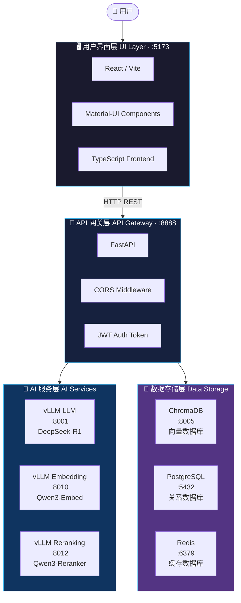
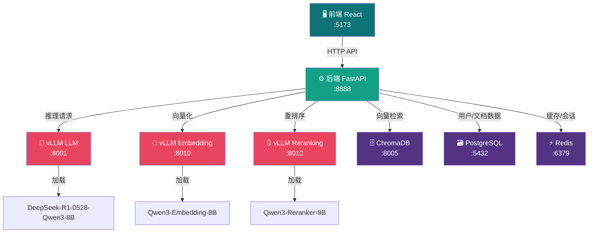
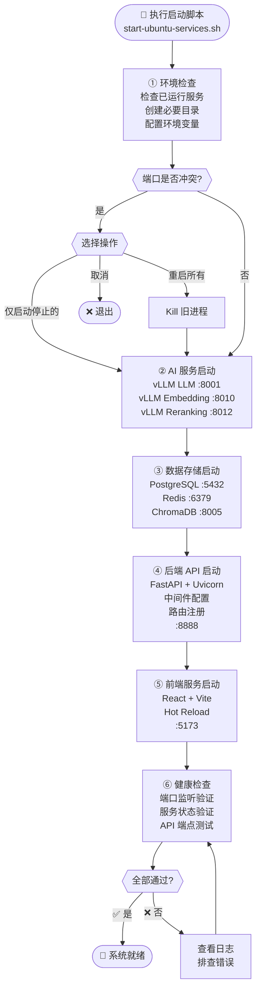
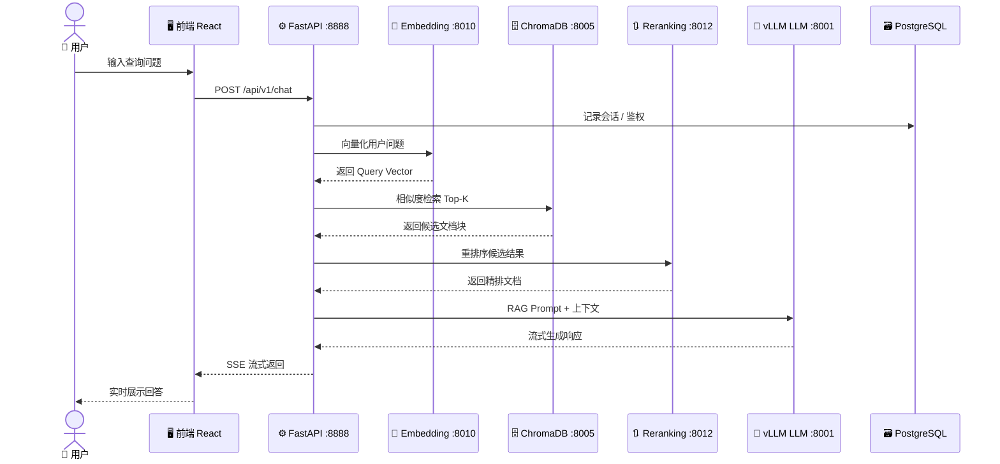
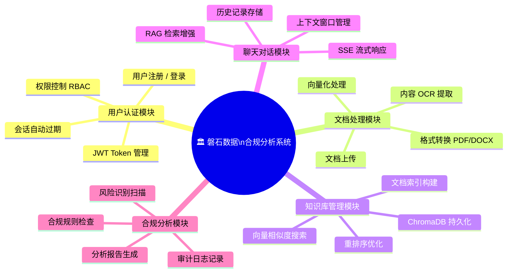
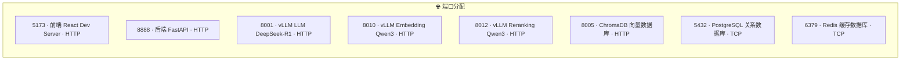
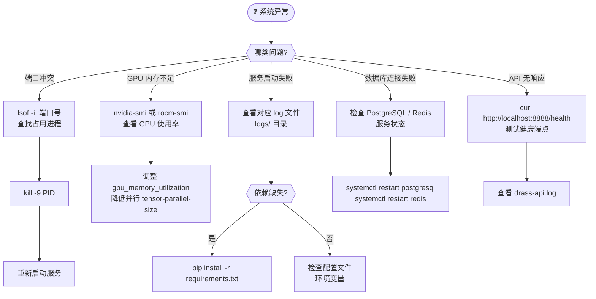
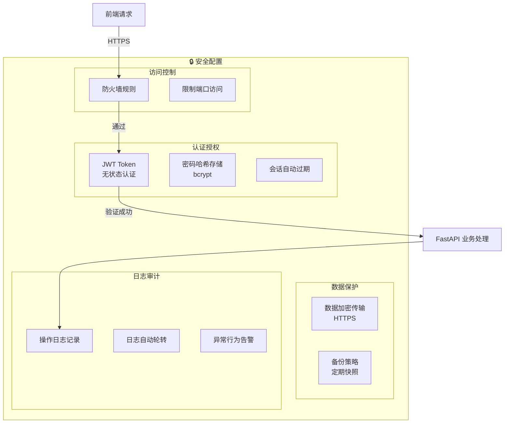

# 磐石数据合规分析系统 - Mermaid 架构图

---

## 1. 系统整体架构图

---

## 2. 服务依赖关系图

---

## 3. 启动流程图

---

## 4. 数据流向图

---

## 5. 核心功能模块图

---

## 6. 端口分配总览

---

## 7. 目录结构图

```mermaid
graph TD
    Root["/home/qwkj/drass/"] --> D1
    Root --> D2
    Root --> D3
    Root --> D4
    Root --> D5
    Root --> D6
    Root --> QS["quick-start.sh"]

    D1["📁 deployment/scripts/"]
    D1 --> D1A["start-ubuntu-services.sh\n主启动脚本"]
    D1 --> D1B["stop-ubuntu-services.sh\n停止脚本"]
    D1 --> D1C["check-frontend.sh\n前端检查脚本"]

    D2["📁 services/main-app/"]
    D2 --> D2A["app/\nFastAPI 应用代码"]
    D2 --> D2B["requirements.txt\nPython 依赖"]
    D2 --> D2C["start_api.sh\nAPI 启动脚本"]

    D3["📁 frontend/"]
    D3 --> D3A["src/\nReact 源码"]
    D3 --> D3B["package.json\nNode.js 依赖"]
    D3 --> D3C["vite.config.ts\nVite 配置"]

    D4["📁 data/"]
    D4 --> D4A["chromadb/\n向量数据库文件"]
    D4 --> D4B["uploads/\n上传文件"]
    D4 --> D4C["processed/\n处理后的文件"]

    D5["📁 logs/"]
    D5 --> D5A["drass-api.log"]
    D5 --> D5B["drass-frontend.log"]
    D5 --> D5C["vllm-llm.log"]
    D5 --> D5D["vllm-embedding.log"]
    D5 --> D5E["vllm-reranking.log"]
    D5 --> D5F["chromadb.log"]

    D6["📁 models/\nAI 模型文件"]
```

---

## 8. 故障排除决策树

---

## 9. 安全架构图

---

> 📌 **渲染提示**：使用 VSCode 插件 `Markdown Preview Mermaid Support` 或 [mermaid.live](https://mermaid.live) 查看图表效果。
>
> 📅 文档版本：v2.0 · 最后更新：2026-04-26
